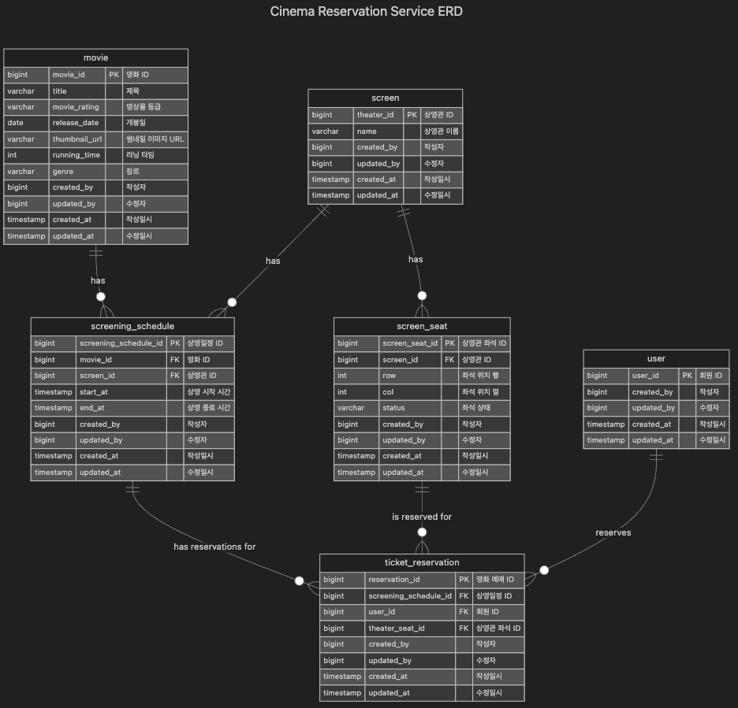

# cinema

## Multi Module Design

### 모듈 구성
```text
+----------------------------------------------------------+
| Controller, Infrastructure (Interface, DB, External API) |  👉 cinema-adapter 모듈  
+----------------------------------------------------------+
|                Application (Use Cases)                   |  👉 cinema-application 모듈  
+----------------------------------------------------------+
|                 Domain (Business Logic)                  |  👉 cinema-domain 모듈  
+----------------------------------------------------------+
```
**클린 아키텍처(Clean Architecture)** 를 기반으로 설계하였으며, 헥사고날 아키텍처(Hexagonal Architecture)의 **포트-어댑터 패턴**을 적용하였습니다.

    1. cinema-adapter
        - 외부 시스템과 연결됩니다.
        - Repository 구현체를 제공하여 DB와 상호 작용합니다.
        - Controller를 통해 클라이언트 요청을 받습니다.
        - DTO, Mapper를 사용하여 응답 변환을 처리합니다.
    2. cinema-application
        - 클린 아키텍처의 `Use Cases`에 해당합니다.
        - 입력/출력 포트에 대한 인터페이스를 정의합니다.
        - 입력 포트(port-in)는 adapter 계층에서 호출됩니다.
        - 출력 포트(port-out) 인터페이스의 구현은 adapter 계층에 존재합니다.
        - 비즈니스 흐름을 제어하고, 도메인 모델을 조합하여 애플리케이션 유스케이스를 구현합니다.
        - 구체적인 저장소(DB) 접근 코드를 포함하지 않습니다.
    3. cinema-domain
        - 외부에 의존하지 않는 독립적이고 핵심적인 비즈니스 로직을 담당합니다.
        - 외부 기술(JPA, Spring, DB 등)에 의존하지 않습니다.
        - 순수한 자바 객체(POJO)만 포함됩니다.

### 데이터 흐름
```text
[Client] 
    ⬇  
Controller (adapter-web)                  출력 포트 구현체 (adapter-out)
    - API 요청 처리                            - DB / 외부 API 호출  
    - 입력 포트 호출                            - Repository, API Client 등  

    ⬇                                                   ↑
입력 포트 (application-port-in)             출력 포트 (application-port-out)  
    - 유스케이스 정의                 ─▶         - 외부 데이터 접근 인터페이스  
    - 도메인 모델과 상호작용

    ⬇  
도메인 (domain-model)
    - 핵심 비즈니스 로직 처리
    - 도메인 객체 변경
```

## Table Design

### ERD


### 테이블 관계
- movie (영화)
  - screening_schedule(상영 일정)과 1:N 관계 (하나의 영화는 여러 상영 일정을 가질 수 있음)
- screen (상영관)
  - screen_seat(상영관 좌석)과 1:N 관계 (하나의 상영관에 여러 개의 좌석이 존재)
  -	screening_schedule(상영 일정)과 1:N 관계 (하나의 상영관에서 여러 영화가 상영 가능)
- screening_schedule (상영 일정)
  - ticket_reservation(영화 예매)과 1:N 관계 (하나의 상영 일정에 여러 예매가 발생 가능)
- screen_seat (상영관 좌석)
  - ticket_reservation(영화 예매)과 1:N 관계 (하나의 좌석이 여러 번 예약될 수 있음)
- user (회원)
  - ticket_reservation(영화 예매)과 1:N 관계 (한 명의 회원이 여러 번 예매 가능)