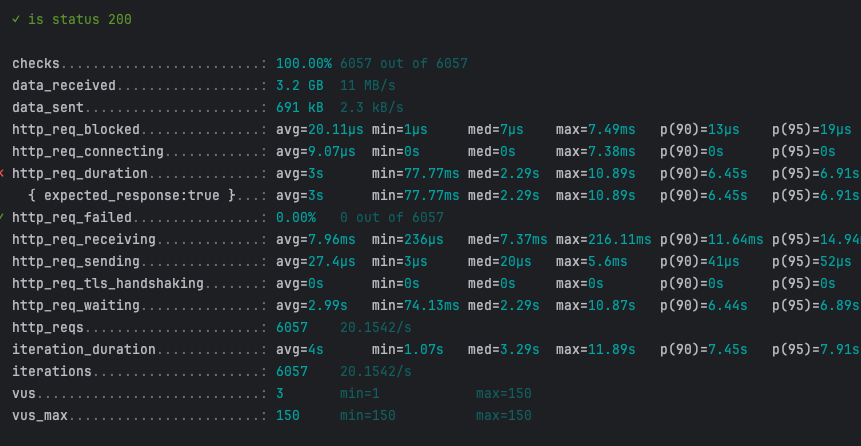
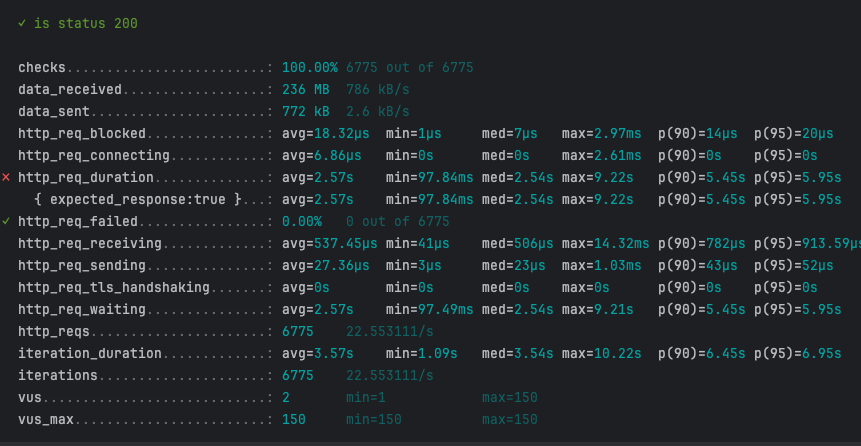
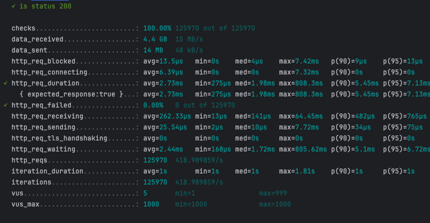
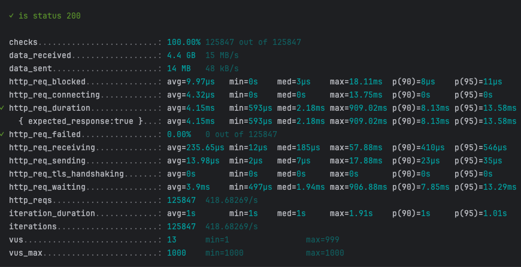

# 성능 테스트 보고서

## 전제 조건
- **DAU**: N명
- **1명당 1일 평균 접속 수**: 2번
- **피크 시간대의 집중률**: 평소 트래픽의 10배
- **Throughput 계산**:
    - **1일 총 접속 수** = DAU × 1명당 1일 평균 접속 수 = N × 2 = **2N** (1일 총 접속 수)
    - **1일 평균 RPS** = 1일 총 접속 수 ÷ 86,400 (초/일)= 2N ÷ 86,400 ≈ **X** **RPS**
    - **1일 최대 RPS** = 1일 평균 RPS × (최대 트래픽 / 평소 트래픽)= X × 10 = **10X RPS**
- VU: N명
- optional
    - thresholds
        - e.g p(95) 의 응답 소요 시간 200ms 이하
        - 실패율 1% 이하
- **더미데이터**:
  - 영화 테이블: 총 500건
  - 상영 일정 테이블: 10만건

## Index 적용 전

- 실제 동작 쿼리
```
select
        me1_0.movie_id,
        me1_0.title,
        me1_0.movie_rating,
        me1_0.release_date,
        me1_0.thumbnail_url,
        me1_0.running_time,
        me1_0.genre,
        se1_0.screen_name,
        sse1_0.started_at,
        sse1_0.ended_at 
    from
        movie me1_0 
    join
        screening_schedule sse1_0 
            on sse1_0.movie_id=me1_0.movie_id 
    join
        screen se1_0 
            on se1_0.screen_id=sse1_0.screen_id 
    where
        sse1_0.started_at> now()
        and me1_0.title like '%Parked%'
        and me1_0.genre= 'ACTION'
    order by
        me1_0.release_date desc,
        sse1_0.started_at
```

- 실행 계획

|id |select_type|table |partitions|type  |possible_keys          |key    |key_len|ref                      |rows  |filtered|Extra                                     |
|---|-----------|------|----------|------|-----------------------|-------|-------|-------------------------|------|--------|------------------------------------------|
|1  |SIMPLE     |se1_0 |          |ALL   |PRIMARY                |       |       |                         |5     |100     |Using temporary; Using filesort           |
|1  |SIMPLE     |sse1_0|          |ALL   |idx_schedule_started_at|       |       |                         |99,722|5       |Using where; Using join buffer (hash join)|
|1  |SIMPLE     |me1_0 |          |eq_ref|PRIMARY,idx_movie_genre|PRIMARY|8      |cinema_db.sse1_0.movie_id|1     |5       |Using where                               |

- 부하 테스트 결과


## Index 적용 후

### 적용한 인덱스 DDL
```
CREATE INDEX idx_movie_release_date ON movie (release_date);
CREATE INDEX idx_movie_genre ON movie (genre);
CREATE FULLTEXT INDEX idx_movie_title ON movie(title);
CREATE INDEX idx_schedule_started_at ON screening_schedule (started_at);
```

### 쿼리
```text
select
        me1_0.movie_id,
        me1_0.title,
        me1_0.movie_rating,
        me1_0.release_date,
        me1_0.thumbnail_url,
        me1_0.running_time,
        me1_0.genre,
        se1_0.screen_name,
        sse1_0.started_at,
        sse1_0.ended_at 
    from
        movie me1_0 
    join
        screening_schedule sse1_0 
            on sse1_0.movie_id=me1_0.movie_id 
    join
        screen se1_0 
            on se1_0.screen_id=sse1_0.screen_id 
    where
        sse1_0.started_at>now()
        and MATCH(me1_0.title) AGAINST ('Parked' IN NATURAL LANGUAGE MODE)>0 
        and me1_0.genre='ACTION'
    order by
        me1_0.release_date desc,
        sse1_0.started_at
```

### 실행 계획
|id |select_type|table |partitions|type    |possible_keys                          |key            |key_len|ref                       |rows  |filtered|Extra                                                           |
|---|-----------|------|----------|--------|---------------------------------------|---------------|-------|--------------------------|------|--------|----------------------------------------------------------------|
|1  |SIMPLE     |m1_0  |          |fulltext|PRIMARY,idx_movie_genre,idx_movie_title|idx_movie_title|0      |const                     |1     |19.2    |Using where; Ft_hints: rank > 0; Using temporary; Using filesort|
|1  |SIMPLE     |sse1_0|          |ALL     |idx_schedule_started_at                |               |       |                          |99,722|5       |Using where                                                     |
|1  |SIMPLE     |s1_0  |          |eq_ref  |PRIMARY                                |PRIMARY        |8      |cinema_db.sse1_0.screen_id|1     |100     |                                                                |


### 부하 테스트 결과


## 로컬 Caching 적용 후

### 캐싱한 데이터의 종류
- caffeine 캐시 사용

### 부하 테스트 결과


## 분산 Caching 적용 후

### 부하 테스트 결과
